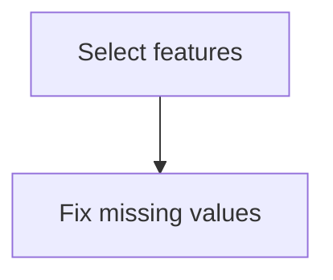
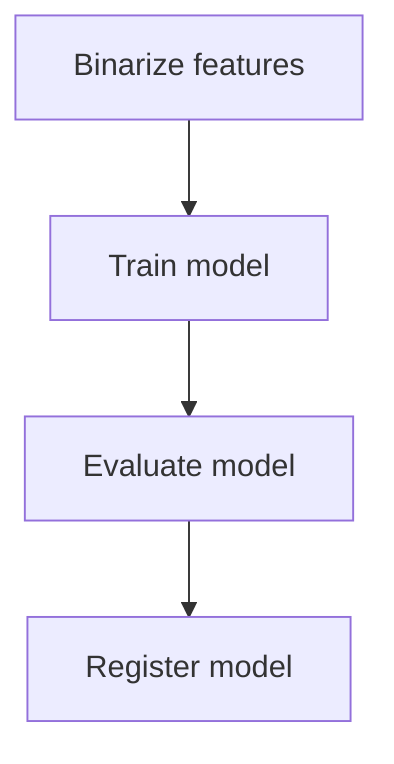

# MLOps end-to-end demo on Azure Machine Learning

Welcome to the MLOps end-to-end demo on Azure Machine Learning repository. 
We use this repository to demonstrate various Azure Machine Learning tool
aspects. We also use the code in this repository to explain various MLOps
topics.

## System requirements

You'll need the following software:

- Python 3.9
- Powershell 7.2
- Visual Studio Code

In addition, you'll need an Azure subscription with a ML workspace.
This repository doesn't contain the code to set it up. You can use the portal
or Azure Bicep to configure the workspace yourself.

## Getting started

Set the following environment variables before running any scripts

```
AZURE_ML_RESOURCE_GROUP=
AZURE_ML_WORKSPACE=
```

The first variable should contain the name of the resource group where the
workspace is deployed. The second variable should include the name of the
workspace itself.

After setting the environment variables, run the following command to login:

```
az login
```

Next, you'll need to set the correct subscription if you have multiple
subscriptions. You can use `az account list` to list all subscriptions.
You can set the active subscription using `az account set --subscription <id>`.

### Registering the dataset

The demo is based on [a dataset from the dutch government][DATASET] containing
information about waiting times for specialist healthcare. You can learn more
about the dataset [here][DATASET_DOCS].

Download the dataset from the website and store it on your machine.
Then, upload the file to the storage account associated with the Azure ML workspace.

Once you've uploaded the dataset, note its relative path. 

Next, open `./data/wachttijden_raw.yml` and modify the `path` property to match
the path where you uploaded the raw dataset.

Finally, run the following command to register the dataset.

```
./register-dataset.ps1
```

This will ensure that we have the dataset available to the pipeline we used
for preparing the dataset and training the model.

### Creating the components

The project uses a machine-learning pipeline composed of components.
We've implemented the pipeline components as Docker containers with Python code.
You can deploy these components by running the following command:

``` 
./create-components.ps1
```

After you've deployed the components, you can start preprocessing the data.

### Data preprocessing

To preprocess the data, run the following command:

```
./prepare-dataset.ps1
```

This will run [the data preparation pipeline](./pipelines/prepare_dataset.yml) that looks like this:



| Step            | Description                                         |                                                       |
| --------------- | --------------------------------------------------- | ----------------------------------------------------- |
| Select features | Selects the input and output features for the model | [Details](components/select_features/component.py)    |
| Fix null values | Replaces missing values with sensible values        | [Details](components/fix_missing_values/component.py) |

After running the preparation step, you end up with a dataset that can be split into a validation and training set.
We've left out the test set for this demo.

### Training the model

When you have the prepared dataset you can train a model using the following script:

```
./train-model.ps1
```

This runs [the model training pipeline](./pipelines/train_model.yml) which looks like this:



Note, that this pipeline contains a single component [Train model](./components/train/component.py).

### Deploying the model to production

After training  the model, we can deploy it to production. Use the following script to create a new endpoint:

```
./deploy-model.ps1
```

This script will perform the following steps:

1. It creates a new endpoint
2. It deploys the model to the production environment and connects it to the endpoint.

Please be aware that this script fails when you already have an endpoint deployed. We recommend commenting out the
line where it deploys the endpoint when this happens. We hope that Microsoft makes operations like this idempotent
shortly.

## Testing the model

When the model is deployed, you can test it using the REST client for VSCode. We've included a script file
in `./sample_requests/score_model.http`. You'll need to modify the URL in the script to match your environment.
You'll also need to use your key to authorize access to your model.

## Documentation

### Project structure

We follow this structure in the project:

```
├── README.md
├── components                         Components used in the pipelines
│   ├── fix_missing_values
│   │   ├── component.py               Implementation of the component in Python
│   │   ├── fix-missing-values.yml     Metadata definition for the component
│   │   └── tests                      Unit-tests to verify component functionality
│   ├── score
│   │   └── score.py                   Script to use during inferencing
│   ├── select_features
│   │   ├── component.py
│   │   ├── select-features.yml
│   │   └── tests
│   └── train                          Script to use during training
├── data                               Metadata definition for the datasets
├── deployments                        Metadata definition for the deployments
├── endpoints                          Metadata definition for the endpoints
├── environments                       Metadata definition for the environments
├── notebooks                          Notebooks used to explore the data
├── pipelines                          Pipeline definitions
│   ├── prepare_dataset.yml
│   └── train_model.yml
└── sample_requests                    Scripts to verify the endpoints and deployments
```

### Guidelines

* We use notebooks only for data exploration. Everything else needs to be done through a pipeline
* We use unit-tests to verify the individual components in the pipeline
* We use powershell scripts to run various pipelines

### Integration with Azure DevOps

We haven't added the CI/CD pipeline logic for Azure DevOps *yet*. You can add this
yourself. We recommend that you have a pipeline in two stages:

* Train the model on Azure ML
* Deploy the model to an environment

You can use the Powershell scripts in your CI/CD pipeline to execute the 
data prep pipeline and training pipeline in Azure ML.

## Issues and ideas

You're welcome to post ideas and issues in the [Issues](https://github.com/wmeints/azure-mlops-demo/issues) section.

[DATASET]: https://puc.overheid.nl/PUC/Handlers/DownloadDocument.ashx?identifier=PUC_656543_22&versienummer=1
[DATASET_DOCS]: https://puc.overheid.nl/nza/doc/PUC_651798_22/1/
